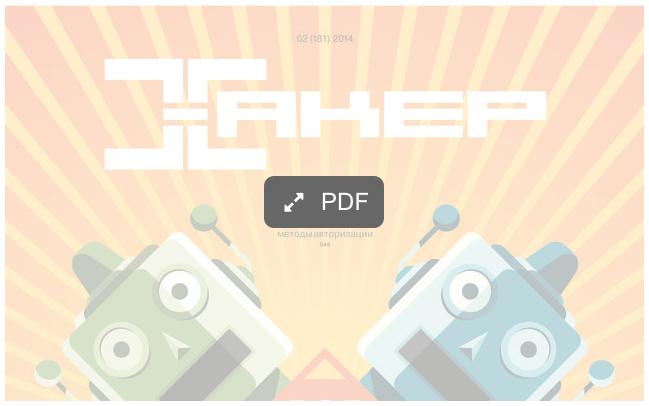

# PDFThumb plugin for Craft CMS

Generate previews of PDF files.

## Pre-requirements

PHP ImageMagick library must be installed.

## How to use

Twig example*:

    

        
        
        

            <a href="{{ block.file.first().url }}"><i class="fa fa-expand"></i> PDF</a>
        

    

where `block.file.first().url` is a URL of PDF file, and `params` can have `width` or `height` properties or both.

\* CSS not included

## Technical support

- Commercial support, adaptation and custom development.  
  [Get help](https://www.Emelchenkov.pro/Services) directly from project author.
- Community support.  
  You can submit questions, bug reports and feature requests to [issue tracker](https://github.com/m-emelchenkov/pdfthumb/issues). It's free, just no SLA guaranteed. [Pull requests](https://github.com/m-emelchenkov/pdfthumb/pulls) are welcome!

Looking for a project maintainer.

## License
Copyright © 2015, 2016 [Mikhail Emelchenkov](https://www.Emelchenkov.pro). Source code is distributed under [CDDL 1.0](https://tldrlegal.com/license/common-development-and-distribution-license-\(cddl-1.0\)-explained) open source license.